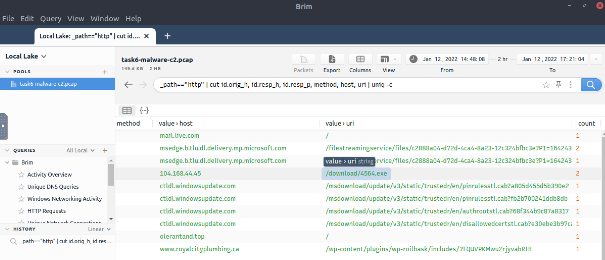
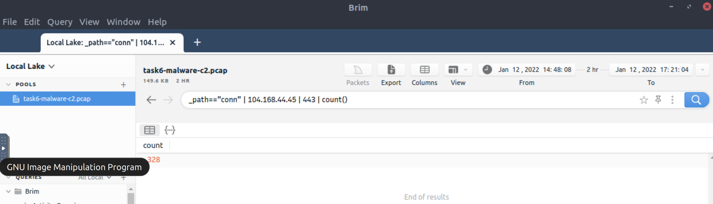
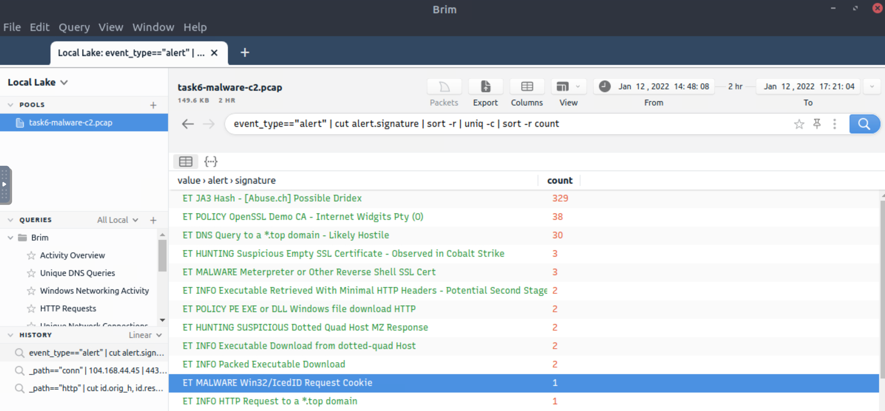
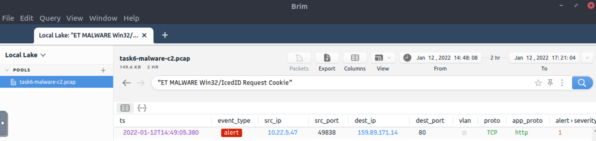

# Malware C2 detection

It is just another malware campaign spread with CobaltStrike. We know an employee clicks on a link, downloads a file, 
and then network speed issues and anomalous traffic activity arises.

## Questions

**What is the name of the file downloaded from the CobaltStrike C2 connection?**

```text
_path=="http" | cut id.orig_h, id.resp_h, id.resp_p, method, host, uri | uniq -c
```

| 
|:--:|
| `4564.exe` |

**What is the number of CobaltStrike connections using port 443?**

```text
_path=="conn" | 104.168.44.45 | 443 | count()
```

| 
|:--:|
| `328` |

There is an additional C2 channel in used the given case. **What is the name of the secondary C2 channel?**

```text
event_type=="alert" | cut alert.signature | sort -r | uniq -c | sort -r count
```

| 
|:--:|
| `IcedID` |

| 
|:--:|
| `Alert` |

Ai.
