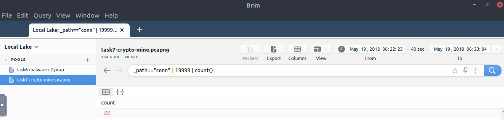
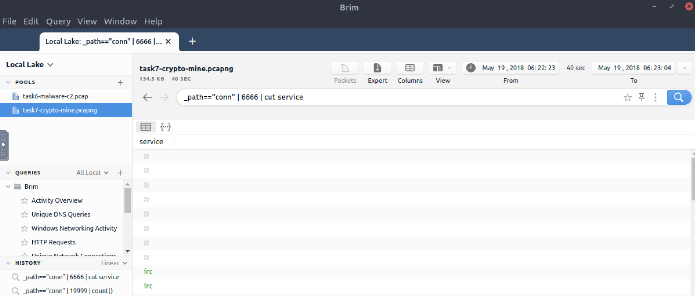
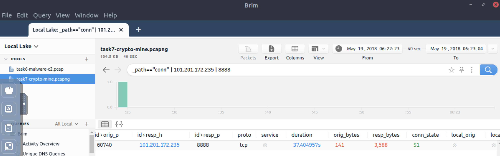
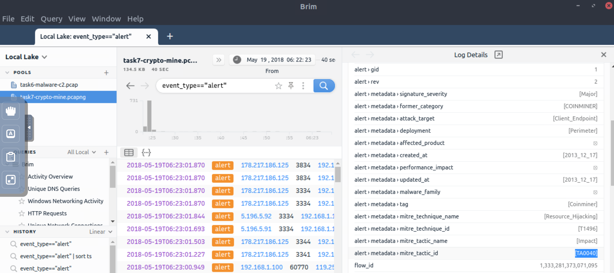

# Crypto mining

Cryptocurrencies are frequently on the agenda with their constantly rising value and legal aspect. The ability to 
obtain cryptocurrencies by mining is becoming one of the biggest problems in today's corporate environments. 
Attackers not only compromise the systems and ask for a ransom, but sometimes they also install mining tools 
(crypto-jacking). Other than the attackers and threat actors, sometimes internal threats and misuse of trust and 
privileges end up installing coin miners in the corporate environment.

Usually, mining cases are slightly different from traditional compromising activities. Internal attacks do not 
typically contain major malware samples. This does not mean they are not malicious as they are exploiting 
essential resources like computing power, internet, and electricity. And crypto mining activities require third 
party applications and tool installations which could be vulnerable or create backdoors. Lastly, mining activities 
are causing network performance and stability problems. 

Coin mining is becoming one of the common use cases of threat hunters.

## Questions

**How many connections used port 19999?**

```text
_path=="conn" | 19999 | count()
```

| 
|:--:|
| `22` |

**What is the name of the service used by port 6666?**

```text
_path=="conn" | 6666 | cut service
```

| 
|:--:|
| `irc` |

**What is the amount of transferred total bytes to `101.201.172.235:8888`?**

```text
_path=="conn" | 101.201.172.235 | 8888
```

| 
|:--:|
| `3,729` |

**What is the detected MITRE tactic id?**

```text
event_type=="alert"
```

| 
|:--:|
| `TA0040` |

Done.
