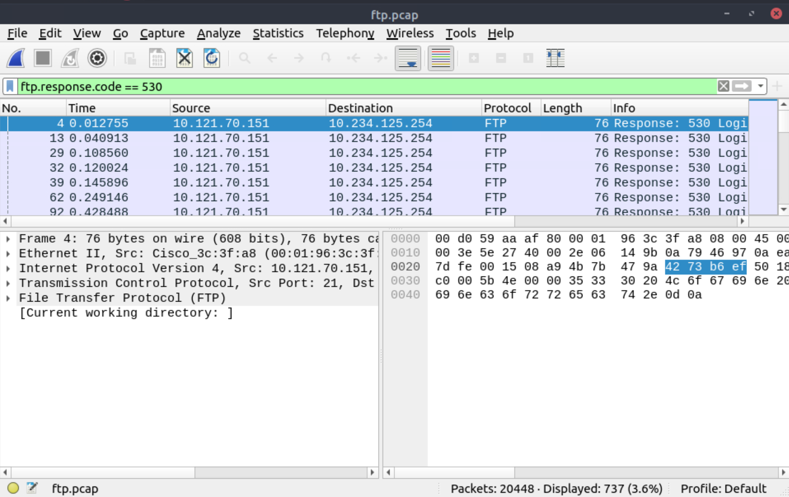
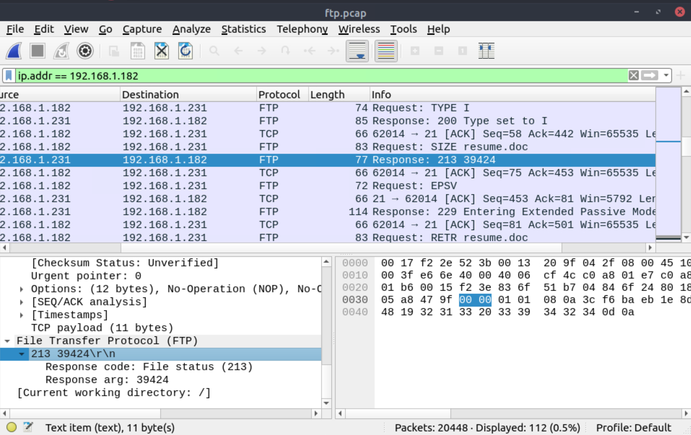
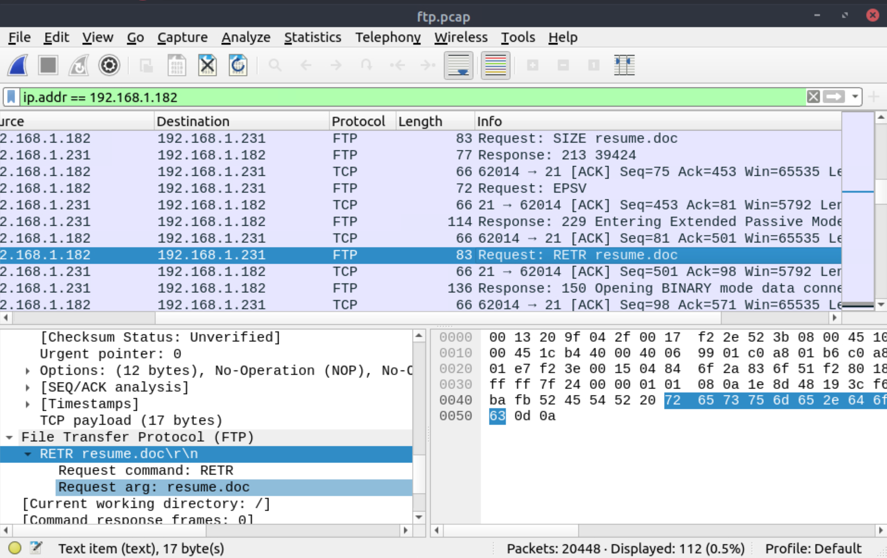
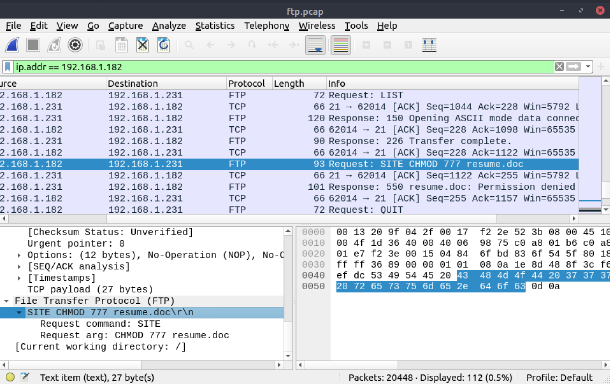
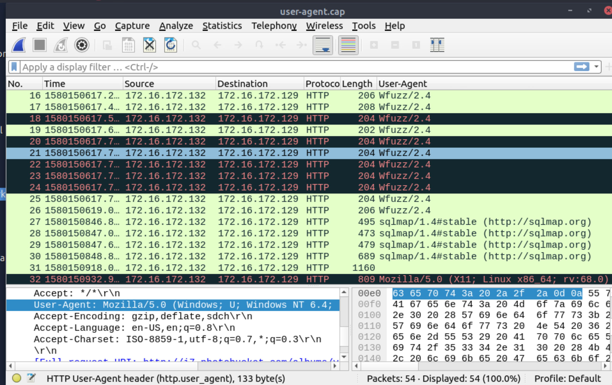
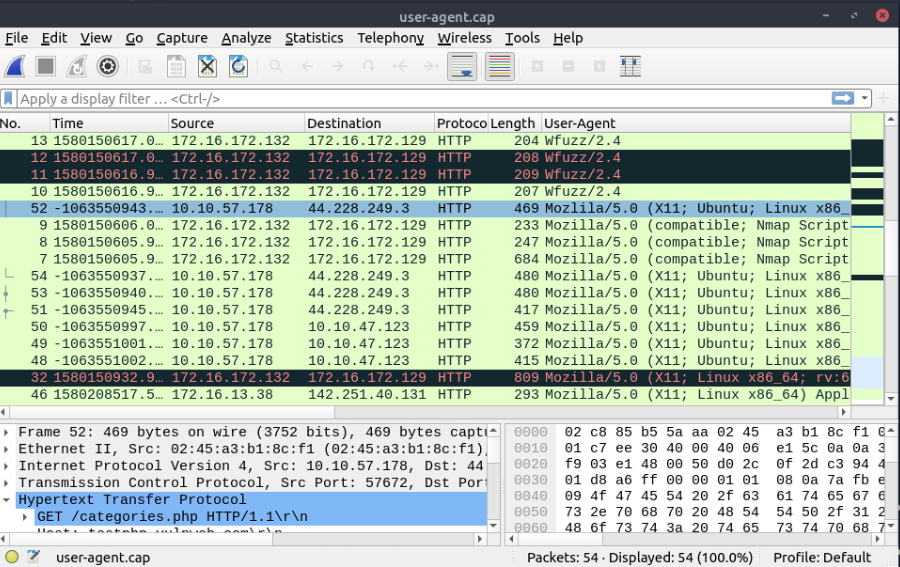
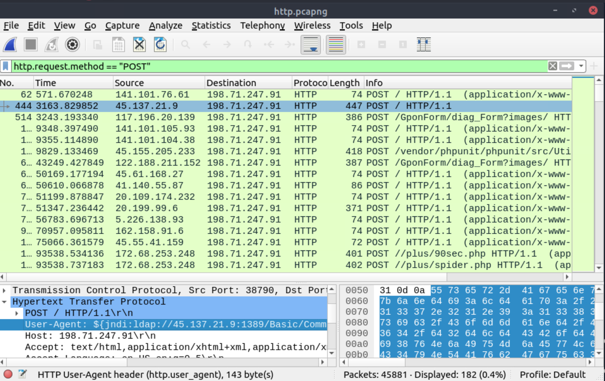
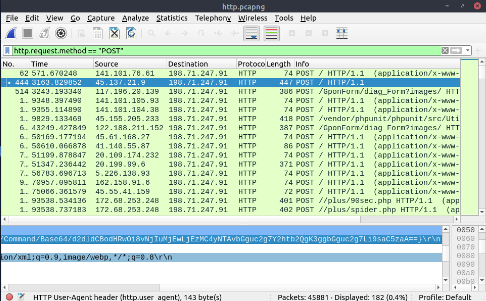
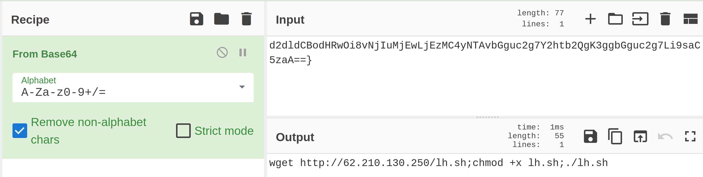

# Clear-text protocol analysis

Investigating clear-text protocol traces sounds easy, but when the time comes to investigate a big network trace for 
incident analysis and response, the game changes. Proper analysis is more than following the stream and reading the 
cleartext data. For a security analyst, it is important to create statistics and key results from the investigation 
process. 

## FTP analysis

File Transfer Protocol (FTP) is designed to transfer files with ease, so it focuses on simplicity rather than security. 
As a result of this, using this protocol in unsecured environments could create security issues like:

* On-path attacks
* Credential stealing and unauthorised access
* Phishing
* Malware planting
* Data exfiltration

## HTTP Analysis

Hypertext Transfer Protocol (HTTP) is a clear-text-based, request-response and client-server protocol. It is the 
standard type of network activity to request/serve web pages, and by default, it is not blocked by any network 
perimeter. As a result of being unencrypted and the backbone of web traffic, HTTP is one of the must-to-know 
protocols in traffic analysis. Following attacks could be detected with the help of HTTP analysis:

* Phishing pages
* Web attacks
* Data exfiltration
* Command and control traffic (C2)

## User-Agent analysis

As the adversaries use sophisticated technics to accomplish attacks, they try to leave traces similar to natural 
traffic through the known and trusted protocols. For a security analyst, it is important to spot the anomaly signs 
on the bits and pieces of the packets. The `user-agent` field is one of the great resources for spotting anomalies 
in HTTP traffic. In some cases, adversaries successfully modify the `user-agent` data, which could look supernatural. 
A security analyst cannot rely only on the `user-agent` field to spot an anomaly. Never whitelist a `user-agent`, even 
if it looks natural. User-agent-based anomaly/threat detection/hunting is an additional data source to check and 
is useful when there is an obvious anomaly.

## Questions

Use the `Desktop/exercise-pcaps/ftp/ftp.pcap` file.

**How many incorrect login attempts are there?**

| 
|:--:|
| `737` |

**What is the size of the file accessed by the `ftp` account?**

| 
|:--:|
| `39424` |

**The adversary uploaded a document to the FTP server. What is the filename?**

| 
|:--:|
| `resume.doc` |

**The adversary tried to assign special flags to change the executing permissions of the uploaded file. What is the command used by the adversary?**

| 
|:--:|
| `chmod 777` |

Use the `Desktop/exercise-pcaps/http/user-agent.cap` file.

**Investigate the user agents. What is the number of anomalous `user-agent` types?**

| 
|:--:|
| `6` |

**What is the packet number with a subtle spelling difference in the user agent field?**

| 
|:--:|
| `52` |

Use the `Desktop/exercise-pcaps/http/http.pcapng` file.

**Locate the `Log4j` attack starting phase. What is the packet number?**

| 
|:--:|
| `444` |

**Locate the `Log4j` attack starting phase and decode the base64 command. What is the IP address contacted by the adversary? (Enter the address in defanged format and exclude `{}`.)**

| 
|:--:|
| `Copy value.` |

| 
|:--:|
| `62[.]210[.]130[.]250` |

.