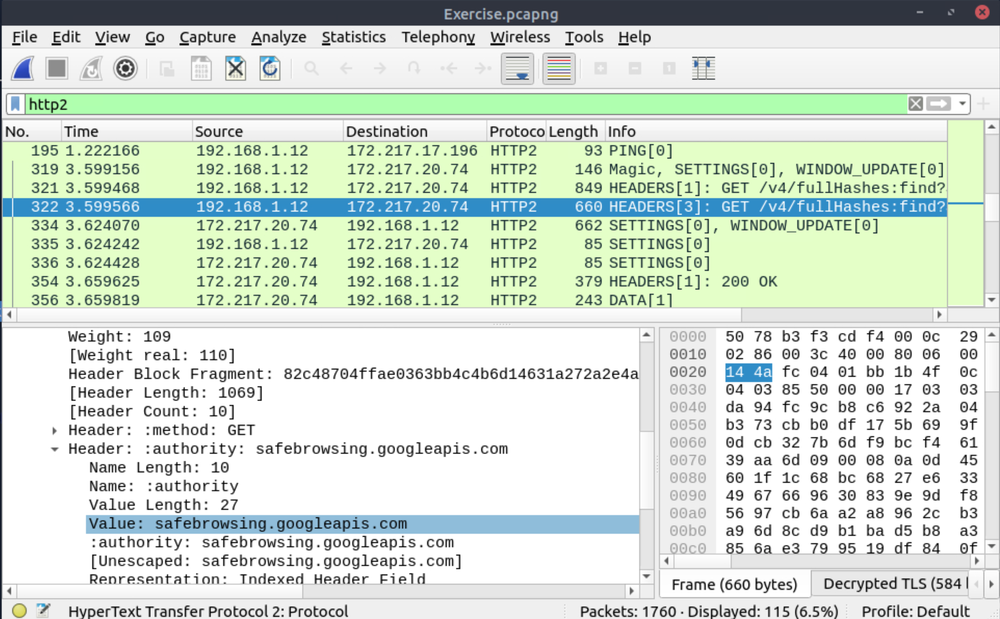

# Encrypted protocol analysis

## Decrypting HTTPS Traffic

When investigating web traffic, analysts often run across encrypted traffic. This is caused by using the Hypertext 
Transfer Protocol Secure (HTTPS) protocol for enhanced security against spoofing, sniffing and intercepting attacks. 
HTTPS uses TLS protocol to encrypt communications, so it is impossible to decrypt the traffic and view the transferred 
data without having the encryption/decryption key pairs. As this protocol provides a good level of security for 
transmitting sensitive data, attackers and malicious websites also use HTTPS. Knowing how to use key files to 
decrypt encrypted traffic and investigate the traffic activity, is a must-have skill.

The packets will appear in different colours as the HTTP traffic is encrypted. Also, protocol and info details 
(actual URL address and data returned from the server) will not be fully visible. 

## Questions

Use the `Desktop/exercise-pcaps/https/Exercise.pcap` file.

**What is the frame number of the `Client Hello` message sent to `accounts.google.com`?**

| 
|:--:|
| `16` |

**Decrypt the traffic with the `KeysLogFile.txt` file. What is the number of HTTP2 packets?**

Edit -> Preferences -> Protocols -> TLS -> Browse for `(Pre)-Master-Secret log filename` -> `KeysLogFile.txt`

| 
|:--:|
| `115` |

**Go to `Frame 322`. What is the authority header of the HTTP2 packet? (Enter the address in defanged format.)**

| 
|:--:|
| `safebrowsing[.]googleapis[.]com` |

**Investigate the decrypted packets and find the flag! What is the flag?**

File -> Export Objects -> HTTP -> Save txt file to Desktop -> Open file.

