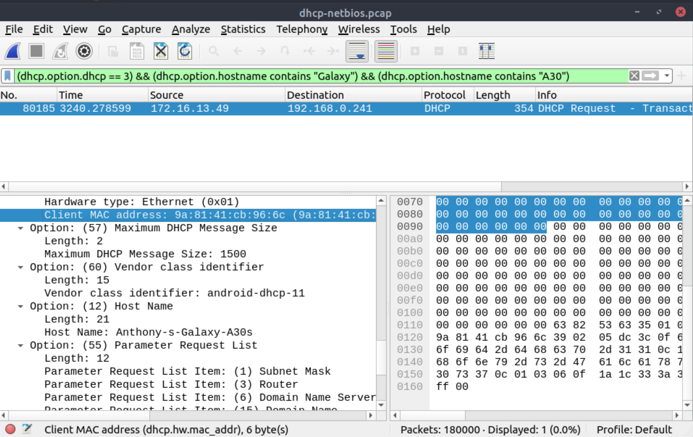
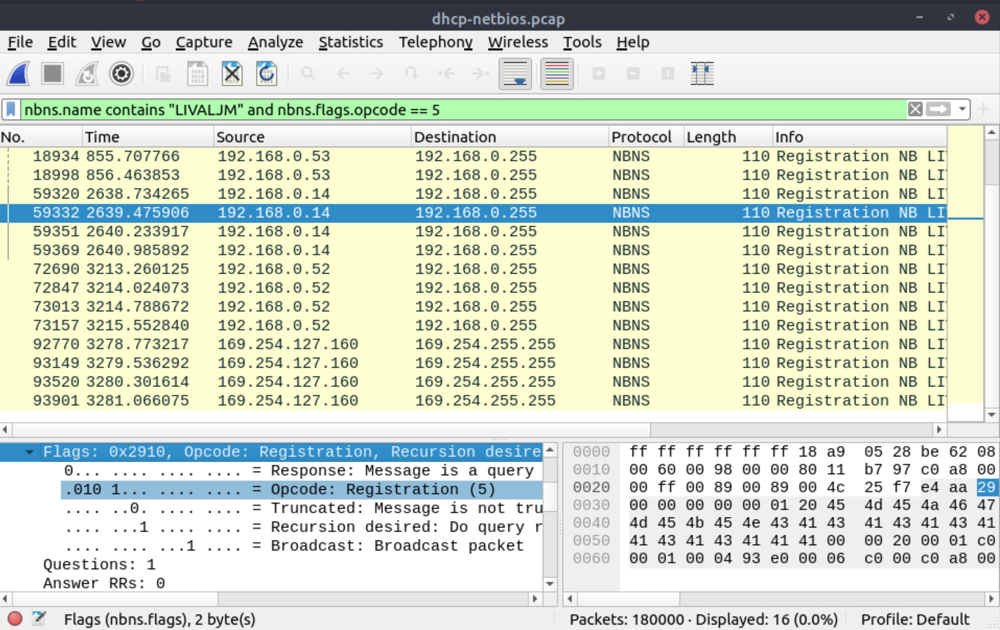
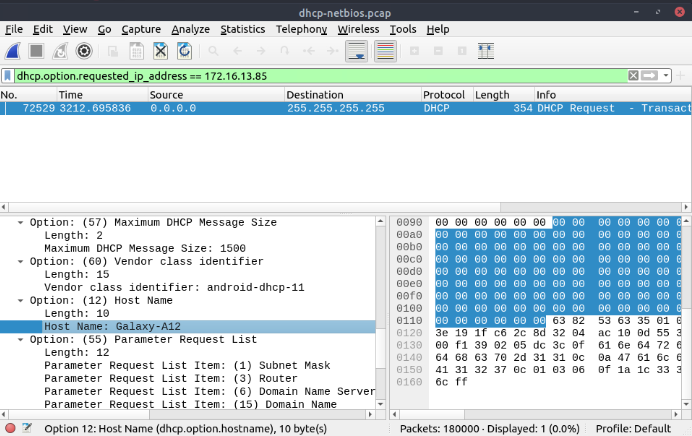
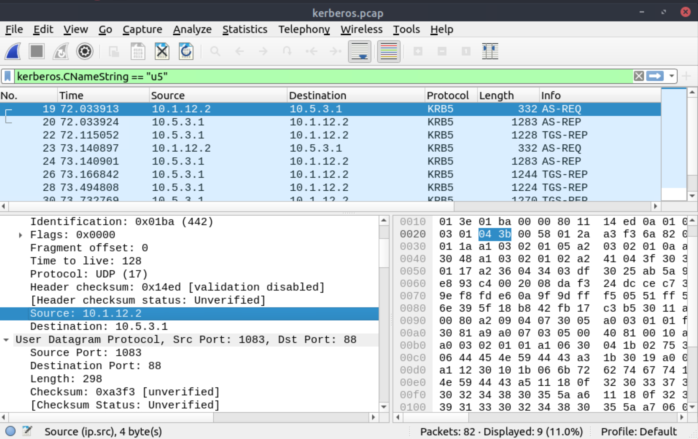
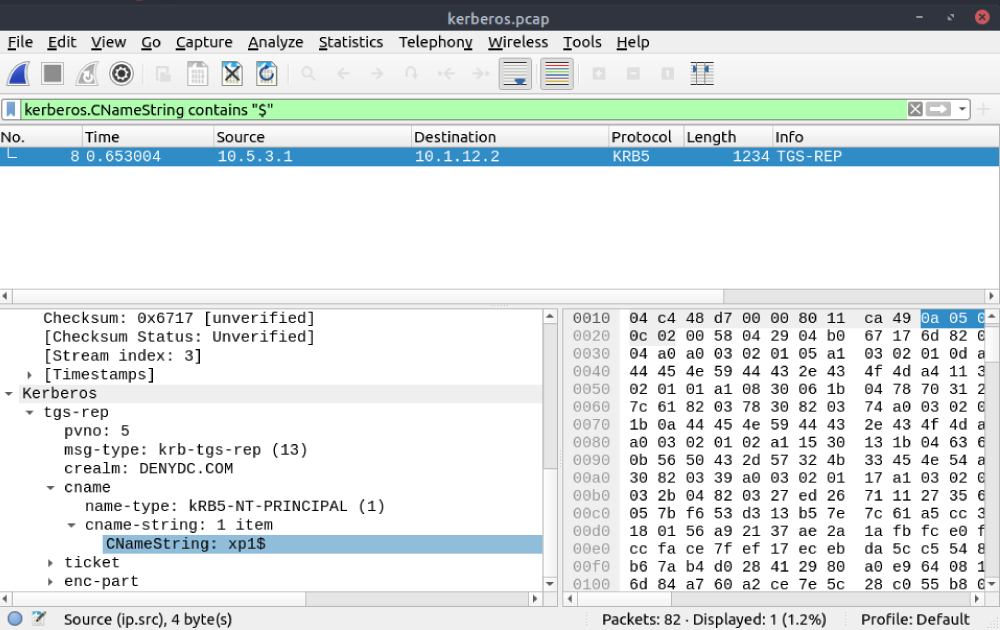

# Identifying hosts

When investigating a compromise or malware infection activity, a security analyst should know how to identify the hosts on the network apart from IP to MAC address match. One of the best methods is identifying the hosts and users on the network to decide the investigation's starting point and list the hosts and users associated with the malicious traffic/activity.

Usually, enterprise networks use a predefined pattern to name users and hosts. While this makes knowing and following the inventory easier, it has good and bad sides. The good side is that it will be easy to identify a user or host by looking at the name. The bad side is that it will be easy to clone that pattern and live in the enterprise network for adversaries. There are multiple solutions to avoid these kinds of activities, but for a security analyst, it is still essential to have host and user identification skills.

Protocols that can be used in Host and User identification:

* Dynamic Host Configuration Protocol (DHCP) traffic, for managing automatic IP address and required communication parameters assignment.
* NetBIOS (NBNS) traffic, for allowing applications on different hosts to communicate with each other.
* Kerberos traffic, for authenticating service requests between two or more computers over the untrusted network. The ultimate aim is to prove identity securely.

## Questions

Use the `Desktop/exercise-pcaps/dhcp-netbios-kerberos/dhcp-netbios.pcap` file.

**What is the MAC address of the host `Galaxy A30`?**

| 
|:--:|
| `9a:81:41:cb:96:6c` |

**How many NetBIOS registration requests does the `LIVALJM` workstation have?**

| 
|:--:|
| `16` |

**Which host requested the IP address `172.16.13.85`?**

| 
|:--:|
| `Galaxy-A12` |

Use the `Desktop/exercise-pcaps/dhcp-netbios-kerberos/kerberos.pcap` file.

**What is the IP address of the user `u5`? (Enter the address in defanged format.)**

| 
|:--:|
| `10[.]1[.]12[.]2` |

**What is the hostname of the available host in the Kerberos packets?**

| 
|:--:|
| `xp1$` |

