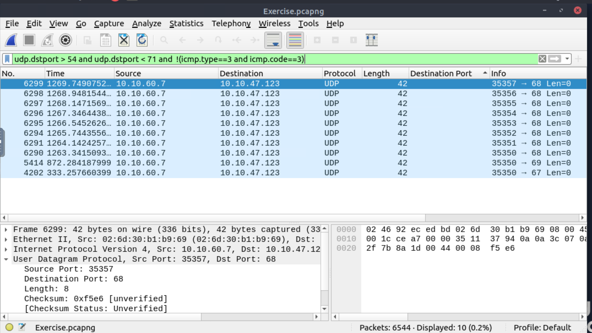

# Nmap scans

Nmap is an industry-standard tool for mapping networks, identifying live hosts and discovering the services. As it is one of the most used network scanner tools, a security analyst should identify the network patterns created with it. This section will cover identifying the most common Nmap scan types.

* TCP connect scans
* SYN scans
* UDP scans

It is essential to know how Nmap scans work to spot scan activity on the network.

## Questions

Use the `Desktop/exercise-pcaps/nmap/Exercise.pcapng` file.

**What is the total number of the `TCP Connect` scans?**

| 
|:--:|
| `1000` |

**Which scan type is used to scan the TCP port 80?**

| 
|:--:|
| `TCP Connect` |

**How many `UDP close port` messages are there?**

| 
|:--:|
| `1083` |

**Which UDP port in the 55-70 port range is open?**

| 
|:--:|
| `68` |
