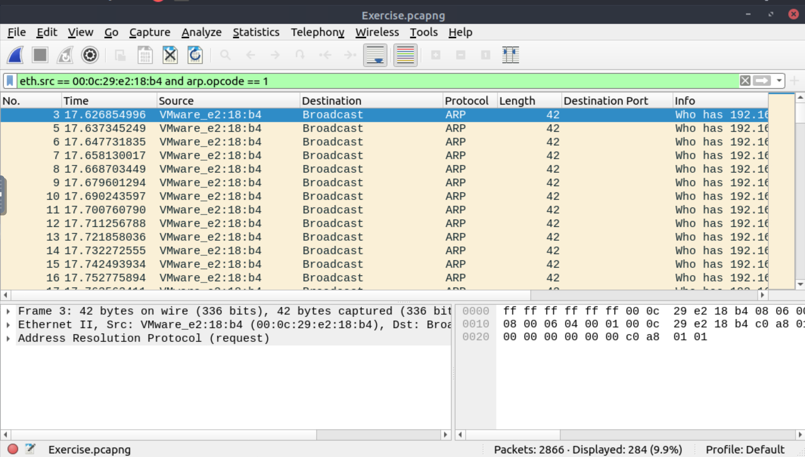
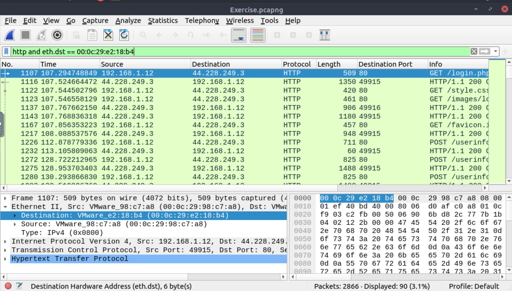
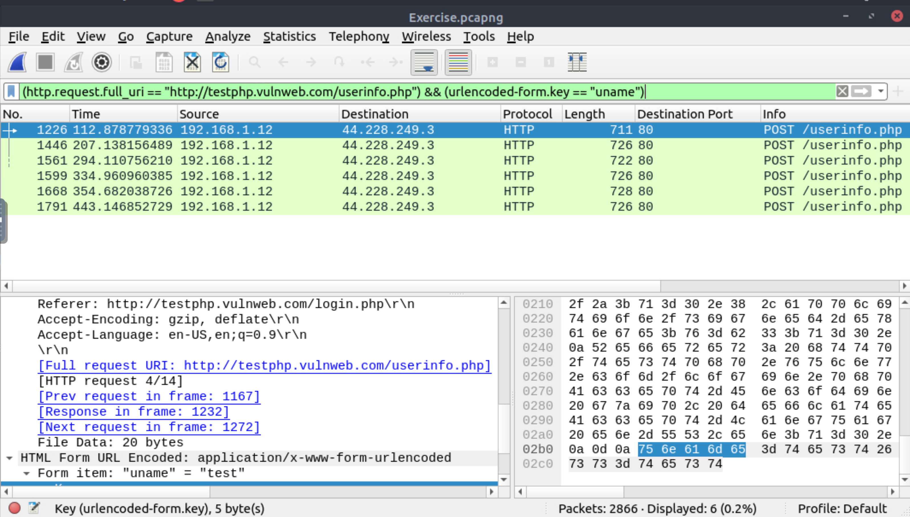
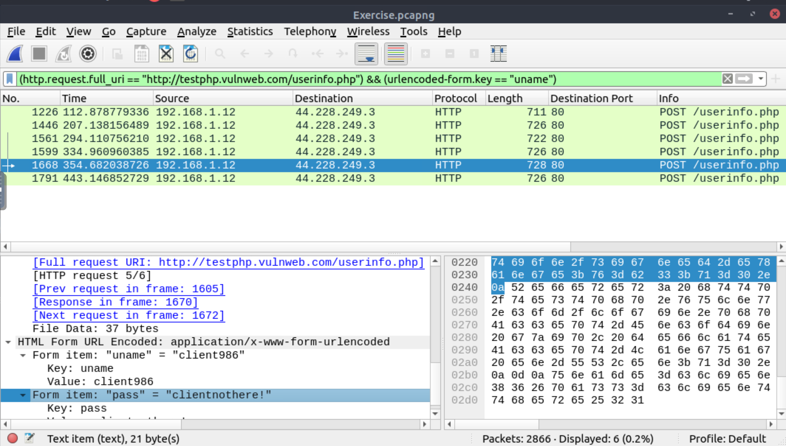
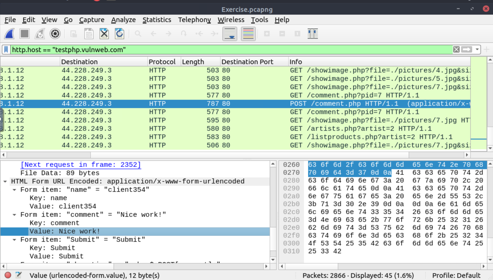

# ARP poisoning & on-path

ARP protocol, or Address Resolution Protocol (ARP), is the technology responsible for allowing devices to identify 
themselves on a network. Address Resolution Protocol Poisoning (also known as 
ARP Spoofing or Man In The Middle (MITM) attack) is a type of attack that involves network jamming/manipulating by 
sending malicious ARP packets to the default gateway. The ultimate aim is to manipulate the "IP to MAC address table" 
and sniff the traffic of the target host.

There are a variety of tools available to conduct ARP attacks. However, the mindset of the attack is static, so it 
is easy to detect such an attack by knowing the ARP protocol workflow and Wireshark skills.

ARP analysis in a nutshell:

* Works on the local network
* Enables the communication between MAC addresses
* Not a secure protocol
* Not a routable protocol
* It doesn't have an authentication function
* Common patterns are request & response, announcement and gratuitous packets.

## Questions

Use the `Desktop/exercise-pcaps/arp/Exercise.pcapng` file.

**What is the number of ARP requests crafted by the attacker?**

| 
|:--:|
| `284` |

**What is the number of HTTP packets received by the attacker?**

| 
|:--:|
| `90` |

**What is the number of sniffed username&password entries?**

| 
|:--:|
| `6` |

**What is the password of the `Client986`?**

| 
|:--:|
| `clientnothere!` |

**What is the comment provided by the `Client354`?**

| 
|:--:|
| `Nice work!` |

.