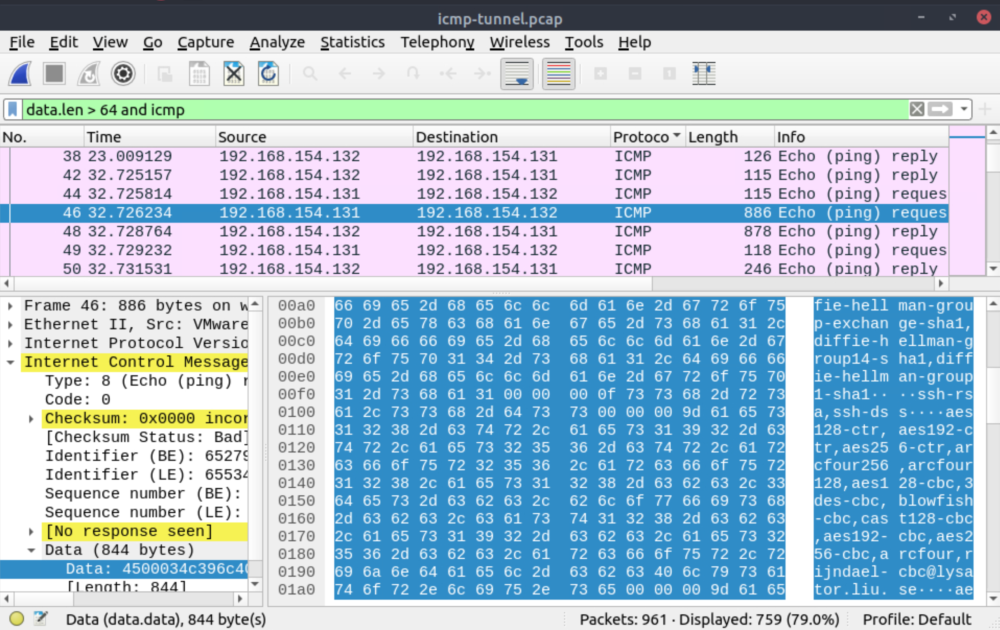
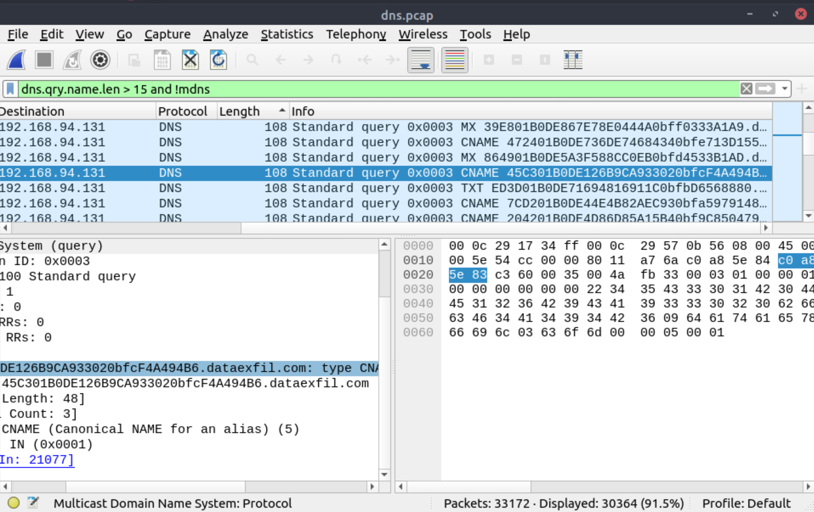

# Tunneling traffic

Traffic tunnelling is (also known as "port forwarding") transferring the data/resources in a secure method to 
network segments and zones. It can be used for "internet to private networks" and "private networks to internet" 
flow/direction. There is an encapsulation process to hide the data, so the transferred data appear natural for 
the case, but it contains private data packets and transfers them to the final destination securely.

Tunnelling provides anonymity and traffic security and is heavily used by enterprise networks. As it gives a 
significant level of data encryption, attackers use tunnelling to bypass security perimeters using the standard and 
trusted protocols used in everyday traffic like ICMP and DNS. It is crucial to have the ability to spot ICMP and 
DNS anomalies.

## ICMP analysis

Internet Control Message Protocol (ICMP) is designed for diagnosing and reporting network communication issues. 
It is used in error reporting and testing. As it is a trusted network layer protocol, sometimes it is used for 
denial of service (DoS) attacks; also, adversaries use it in data exfiltration and C2 tunnelling activities.

Usually, ICMP tunnelling attacks are anomalies appearing/starting after a malware execution or vulnerability 
exploitation. As the ICMP packets can transfer an additional data payload, adversaries use this section to 
exfiltrate data and establish a C2 connection. It could be a TCP, HTTP or SSH data. As the ICMP protocols provide 
a great opportunity to carry extra data, it also has disadvantages. Most enterprise networks block custom packets 
or require administrator privileges to create custom ICMP packets.

A large volume of ICMP traffic or anomalous packet sizes are indicators of ICMP tunnelling. 
And be aware, adversaries can create custom packets that match the regular ICMP packet size (64 bytes), so it is 
still cumbersome to detect these tunnelling activities.

## DNS analysis

Domain Name System (DNS) is designed to translate/convert IP domain addresses to IP addresses. It is also known as 
a phonebook of the internet. As it is the essential part of web services, it is commonly used and trusted, and 
therefore also often ignored. Due to that, adversaries use it in data exfiltration and C2 activities.

Similar to ICMP tunnels, DNS attacks are anomalies appearing/starting after a malware execution or vulnerability 
exploitation. Adversary creates (or already has) a domain address and configures it as a C2 channel. The malware 
or the commands executed after exploitation sends DNS queries to the C2 server. These queries are longer than 
default DNS queries and crafted for subdomain addresses. And these subdomain addresses are not actual addresses; 
they are encoded commands.

    encoded-commands.maliciousdomain.com

When this query is routed to the C2 server, the server sends the actual malicious commands to the host. As the DNS 
queries are a natural part of the networking activity, these packets have the chance of not being detected by network 
perimeters.

## Questions

Use the `Desktop/exercise-pcaps/dns-icmp/icmp-tunnel.pcap` file.

**Investigate the anomalous packets. Which protocol is used in ICMP tunnelling?**

| 
|:--:|
| `ssh` |

Use the `Desktop/exercise-pcaps/dns-icmp/dns.pcap` file.

**Investigate the anomalous packets. What is the suspicious main domain address that receives anomalous DNS queries? (Enter the address in defanged format.)**

| 
|:--:|
| `dataexfil[.]com` |

.