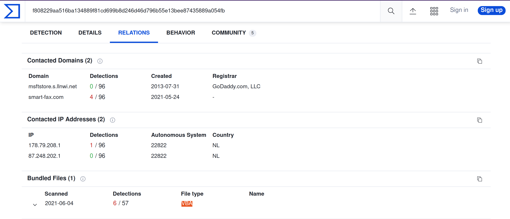
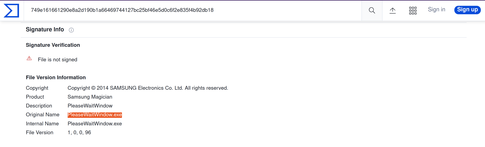
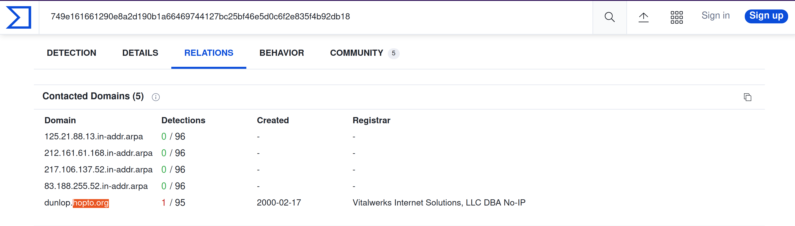

# Phishing

An alert triggered: `Phishing Attempt`.

The case was assigned to you. Inspect the PCAP and retrieve the artefacts to confirm this alert is a true positive. 

## Questions

Investigate the logs. 

    zeek -Cr phishing.pcap hash-demo.zeek

Investigate the `http.log` file. **What is the suspicious source address?** **Which domain address were the malicious files downloaded from?**

```text
ubuntu@ip-10-10-177-209:~/Desktop/Exercise-Files/phishing$ cat http.log
#separator \x09
#set_separator	,
#empty_field	(empty)
#unset_field	-
#path	http
#open	2022-11-29-02-56-39
#fields	ts	uid	id.orig_h	id.orig_p	id.resp_h	id.resp_p	trans_depth	method	host	uri	referrer	version	user_agent	origin	request_body_len	response_body_len	status_code	status_msg	info_code	info_msg	tags	username	passwordproxied	orig_fuids	orig_filenames	orig_mime_types	resp_fuids	resp_filenames	resp_mime_types
#types	time	string	addr	port	addr	port	count	string	string	string	string	string	string	string	count	count	count	string	count	string	set[enum]	string	string	set[string]	vector[string]	vector[string]	vector[string]	vector[string]	vector[string]	vector[string]
1561667874.713411	CdfiWK1W5IpFJonQo7	10.6.27.102	49157	23.63.254.163	80	1	GET	www.msftncsi.com	/ncsi.txt	-	1.1	Microsoft NCSI	-	0	14	200	OK	-	-	(empty)	-	-	-	-	-	-	Fpgan59p6uvNzLFja	-text/plain
1561667889.643717	CqVUHAd2v5ksfZO5	10.6.27.102	49159	107.180.50.162	80	1	GET	smart-fax.com	/Documents/Invoice&MSO-Request.doc	-	1.1	Mozilla/5.0 (Windows NT 6.1; WOW64; Trident/7.0; rv:11.0) like Gecko	-	0	323072	200	OK	-	-	(empty)--	-	-	-	-	FB5o2Hcauv7vpQ8y3	-	application/msword
1561667898.911759	CpgTPr4QCCxl5g5Rl6	10.6.27.102	49162	107.180.50.162	80	1	GET	smart-fax.com	/knr.exe	-	1.1	Mozilla/4.0 (compatible; MSIE 7.0; Windows NT 6.1; WOW64; Trident/7.0; SLCC2; .NET CLR 2.0.50727; .NET CLR 3.5.30729; .NET CLR 3.0.30729; Media Center PC 6.0; .NET4.0C; .NET4.0E)	-	0	2437120	200	OK	-	-	(empty)	-	-	-	-	-	-	FOghls3WpIjKpvXaEl	-application/x-dosexec
#close	2022-11-29-02-56-39
```

Investigate the malicious document in VirusTotal. **What kind of file is associated with the malicious document?**

```text
ubuntu@ip-10-10-177-209:~/Desktop/Exercise-Files/phishing$ cat files.log | zeek-cut md5
cd5a4d3fdd5bffc16bf959ef75cf37bc
b5243ec1df7d1d5304189e7db2744128
cc28e40b46237ab6d5282199ef78c464
```

| 
|:--:|
| `VBA` |

Investigate the extracted malicious `.exe` file. **What is the given file name in Virustotal?**

| 
|:--:|
| `PleaseWaitWindow.exe` |

Investigate the malicious `.exe` file in VirusTotal. **What is the contacted domain name?**

| 
|:--:|
| `hopto[.]org` |

Investigate the `http.log` file. **What is the request name of the downloaded malicious `.exe` file?**

```text
ubuntu@ip-10-10-177-209:~/Desktop/Exercise-Files/phishing$ cat http.log        
...
#fields	ts	uid	id.orig_h	id.orig_p	id.resp_h	id.resp_p	trans_depth	method	host	uri	referrer	version	user_agent	origin	request_body_len	response_body_len	status_code	status_msg	info_code	info_msg	tags	username	passwordproxied	orig_fuids	orig_filenames	orig_mime_types	resp_fuids	resp_filenames	resp_mime_types
...
1561667898.911759	CUaS7e4eL8o256JIVb	10.6.27.102	49162	107.180.50.162	80	1	GET	smart-fax.com	/knr.exe	-	1.1	Mozilla/4.0 (compatible; MSIE 7.0; Windows NT 6.1; WOW64; Trident/7.0; SLCC2; .NET CLR 2.0.50727; .NET CLR 3.5.30729; .NET CLR 3.0.30729; Media Center PC 6.0; .NET4.0C; .NET4.0E)	-	0	2437120	200	OK	-	-	(empty)	-	-	-	-	-	-	FOghls3WpIjKpvXaEl	-application/x-dosexec
#close	2022-11-29-03-09-38
```
