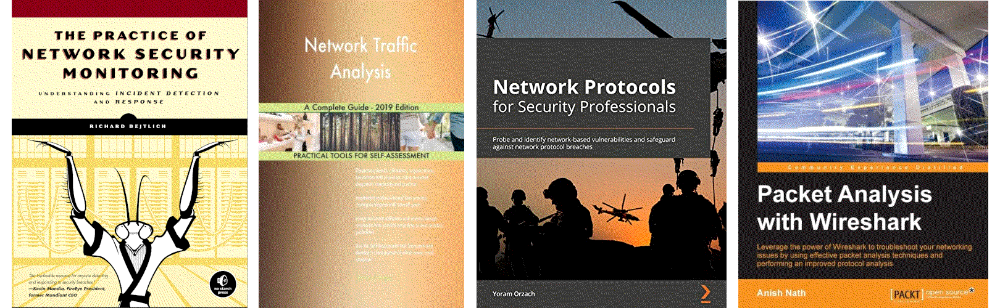

Network traffic analysis (NTA)
=================================================================

Spot and probe network anomalies using industry tools and techniques.

.. image:: _static/images/in-progress.png
  :alt: Forever in progress ...

----

.. toctree::
   :maxdepth: 1
   :includehidden:
   :caption: Testlab

   Network traffic analysis tools <https://testlab.tymyrddin.dev/docs/dfir/README>

----

TryHackMe rooms
-------------------------------------

.. toctree::
   :maxdepth: 1
   :includehidden:
   :caption: Wireshark

   docs/wireshark/README.md
   docs/wireshark/nmap.md
   docs/wireshark/on-path.md
   docs/wireshark/hosts.md
   docs/wireshark/tunnels.md
   docs/wireshark/clear-text.md
   docs/wireshark/encrypted.md
   docs/wireshark/creds.md
   docs/wireshark/rules.md

.. toctree::
   :maxdepth: 1
   :includehidden:
   :caption: Snort

   docs/snort/README.md
   docs/snort/ids-rules.md
   docs/snort/ms17-010.md
   docs/snort/log4j.md
   docs/snort/brute-force.md
   docs/snort/reverse-shell.md

.. toctree::
   :maxdepth: 1
   :includehidden:
   :caption: NetworkMiner

   docs/miner/README.md
   docs/miner/forensics.md

.. toctree::
   :maxdepth: 1
   :includehidden:
   :caption: Zeek

   docs/zeek/README.md
   docs/zeek/monitoring.md
   docs/zeek/signatures.md
   docs/zeek/scripts.md
   docs/zeek/and.md
   docs/zeek/frameworks.md
   docs/zeek/packages.md
   docs/zeek/dns.md
   docs/zeek/phishing.md
   docs/zeek/log4j.md

.. toctree::
   :maxdepth: 1
   :includehidden:
   :caption: Brim

   docs/brim/README.md
   docs/brim/use-cases.md
   docs/brim/malware.md
   docs/brim/mining.md

----

.. toctree::
   :glob:
   :maxdepth: 1
   :includehidden:
   :caption: Root-me challenges

   docs/root-me/README.md
   docs/root-me/ftp-authentication.md
   docs/root-me/telnet-authentication.md
   docs/root-me/ethernet-frame.md
   docs/root-me/twitter-authentication.md
   docs/root-me/bl-unknown-file.md
   docs/root-me/cisco-password.md
   docs/root-me/zone-transfer.md
   docs/root-me/ip-ttl.md
   docs/root-me/ldap-null.md
   docs/root-me/pop-apop.md
   docs/root-me/sip-authentication.md
   docs/root-me/ethernet-patched.md
   docs/root-me/global-mobile.md
   docs/root-me/ssl.md

----

